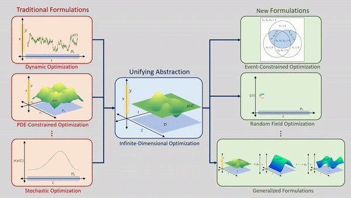

---

A `JuMP` extension for expressing and solving infinite-dimensional optimization
problems. Such areas include [stochastic programming](https://en.wikipedia.org/wiki/Stochastic_programming),
[dynamic programming](https://en.wikipedia.org/wiki/Dynamic_programming),
space-time optimization, and more. `InfiniteOpt` serves as an easy-to-use modeling
interface for these advanced problem types that can be used by those with little
to no background in these areas. It also it contains a wealth of capabilities
making it a powerful and convenient tool for advanced users.  

**Current Version:** [](https://juliahub.com/ui/Packages/InfiniteOpt/p3GvY) [](https://juliahub.com/ui/Packages/InfiniteOpt/p3GvY)

| **Documentation**                                                               | **Build Status**                                                                                | **Citation** |
|:-------------------------------------------------------------------------------:|:-----------------------------------------------------------------------------------------------:|:--------------------------------------:|
| [](https://infiniteopt.github.io/InfiniteOpt.jl/stable) | [](https://github.com/infiniteopt/InfiniteOpt.jl/actions?query=workflow%3ACI) [](https://codecov.io/github/infiniteopt/InfiniteOpt.jl?branch=release-0.5) | [](https://doi.org/10.1016/j.compchemeng.2021.107567) |
| [](https://infiniteopt.github.io/InfiniteOpt.jl/dev) | [](https://github.com/infiniteopt/InfiniteOpt.jl/actions?query=workflow%3ACI) [](https://codecov.io/github/infiniteopt/InfiniteOpt.jl?branch=master) | |

It builds upon `JuMP` to add support for many complex modeling objects which 
include:
- Infinite parameters (e.g., time, space, uncertainty, etc.)
- Finite parameters (similar to `ParameterJuMP`)
- Infinite variables (decision functions) (e.g., `y(t, x)`)
- Derivatives (e.g., `∂y(t, x)/∂t`)
- Measures (e.g., `∫y(t,x)dt`, `𝔼[y(ξ)]`)

The unifying modeling abstraction behind `InfiniteOpt` captures a wide spectrum 
of disciplines which include dynamic, PDE, stochastic, and semi-infinite 
optimization. Moreover, we facilitate transferring techniques between these 
to synthesize new optimization paradigms!



Comments, suggestions and improvements are welcome and appreciated.

## License
`InfiniteOpt` is licensed under the [MIT "Expat" license](./LICENSE).

## Installation
`InfiniteOpt.jl` is a registered [Julia](https://julialang.org/) package and 
can be installed by entering the following in the REPL.

```julia
julia> ]

(v1.10) pkg> add InfiniteOpt
```

## Documentation
[](https://infiniteopt.github.io/InfiniteOpt.jl/stable)

Please visit our [documentation pages](https://infiniteopt.github.io/InfiniteOpt.jl/stable) 
to learn more. These pages are quite extensive and feature overviews, guides,
manuals, tutorials, examples, and more!

## Questions
For additional help please visit and post in our 
[discussion forum](https://github.com/infiniteopt/InfiniteOpt.jl/discussions).

## Citing
[](https://doi.org/10.1016/j.compchemeng.2021.107567) 
[](https://arxiv.org/abs/2106.12689)

If you use InfiniteOpt.jl in your research, we would greatly appreciate your 
citing it.
```latex
@article{pulsipher2022unifying,
      title = {A unifying modeling abstraction for infinite-dimensional optimization},
      journal = {Computers & Chemical Engineering},
      volume = {156},
      year = {2022},
      issn = {0098-1354},
      doi = {https://doi.org/10.1016/j.compchemeng.2021.107567},
      url = {https://www.sciencedirect.com/science/article/pii/S0098135421003458},
      author = {Joshua L. Pulsipher and Weiqi Zhang and Tyler J. Hongisto and Victor M. Zavala},
}
```
A pre-print version is freely available though [arXiv](https://arxiv.org/abs/2106.12689).

## Project Status
The package is tested against Julia `1.6` and `1.10` on Linux, Mac, and Windows.

## Contributing
`InfiniteOpt` is being actively developed and suggestions or other forms of contribution are encouraged.
There are many ways to contribute to this package. For more information please
visit [CONTRIBUTING](https://github.com/infiniteopt/InfiniteOpt.jl/blob/master/CONTRIBUTING.md).
