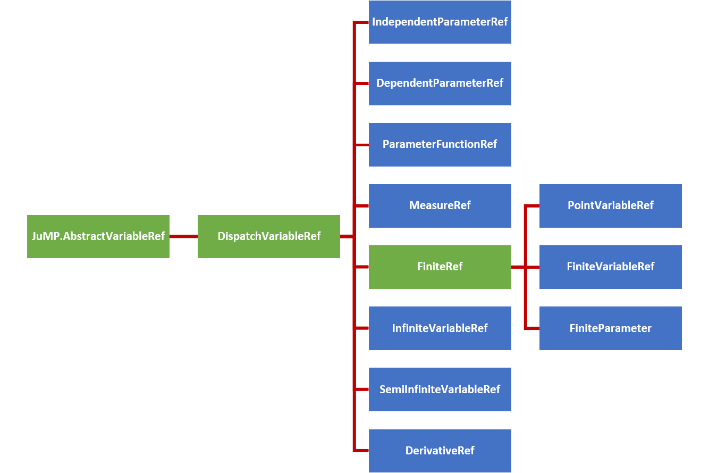

```@meta
DocTestFilters = [r"≤|<=", r" == | = ", r" ∈ | in ", r"MathOptInterface|MOI",
                  r" for all | ∀ ", r"d|∂", r"integral|∫"]
```

# [Expressions](@id expr_docs)
A guide for the defining and understanding the variable expressions 
used in `InfiniteOpt`. See the [technical manual](@ref expr_manual) for more 
details.

!!! note 
    Nonlinear objects as defined by `JuMP.@NL[macro_name]` are not currently 
    supported by `InfiniteOpt`. See [Nonlinear Expressions](@ref) for more 
    information and possible workarounds. 

## Overview
Expressions in `InfiniteOpt` (also called functions) refer to mathematical 
statements involving variables and numbers. Thus, these comprise the 
mathematical expressions used that are used in measures, objectives, and 
constraints. Programmatically, `InfiniteOpt` simply extends `JuMP` expression 
types and methods principally pertaining to affine and quadratic mathematical 
expressions. A natively supported abstraction for general nonlinear expressions 
is planned for development since that of `JuMP` is not readily extendable.

## [Parameter Functions](@id par_func_docs)
As described further below, InfiniteOpt.jl only supports affine and quadratic 
expressions in its current rendition. However, there several use cases where we 
might want to provide a more complex known function of infinite parameter(s) (e.g., 
nonlinear setpoint tracking). Thus, we provide parameter function objects 
that given a particular realization of infinite parameters will output a scalar 
value. Note that this can be interpreted as an infinite variable that is 
constrained to a particular known function. This is accomplished via 
[`@parameter_function`](@ref) or [`parameter_function`](@ref) and is exemplified 
by defining a parameter function `f(t)` that uses `sin(t)`:
```jldoctest param_func
julia> using InfiniteOpt;

julia> model = InfiniteModel();

julia> @infinite_parameter(model, t in [0, 10]);

julia> @parameter_function(model, f == sin(t))
f(t)
```
Here we created an parameter function object, added it to `model`, and 
then created a Julia variable `f` that serves as a `GeneralVariableRef` that points 
to it. From here we can treat `f` as a normal infinite variable and use it with 
measures, derivatives, and constraints. For example, we can do the following:
```jldoctest param_func
julia> @variable(model, y, Infinite(t));

julia> df = deriv(f, t)
∂/∂t[f(t)]

julia> meas = integral(y - f, t)
∫{t ∈ [0, 10]}[y(t) - f(t)]

julia> @constraint(model, y - f <= 0)
y(t) - f(t) ≤ 0.0, ∀ t ∈ [0, 10]
```
We can also define parameter functions that depend on multiple infinite 
parameters even use an anonymous function if prefer:
```jldoctest param_func
julia> @infinite_parameter(model, x[1:2] in [-1, 1]);

julia> @parameter_function(model, myname == (t, x) -> t + sum(x))
myname(t, x)
```
In many applications, we may also desire to define an array of parameter functions 
that each use a different realization of some parent function by varying some 
additional positional/keyword arguments. We readily support this behavior since 
parameter functions can be defined with additional known arguments:
```jldoctest param_func
julia> @parameter_function(model, pfunc_alt[i = 1:3] == t -> mysin(t, as[i], b = 0))
3-element Vector{GeneralVariableRef}:
 pfunc_alt[1](t)
 pfunc_alt[2](t)
 pfunc_alt[3](t)
```
The main recommended use case for [`parameter_function`](@ref) is that it is 
amendable to defining complex anonymous functions via a do-block which is useful 
for applications like defining a time-varied setpoint:
```jldoctest param_func
julia> setpoint = parameter_function(t, name = "setpoint") do t_supp
                    if t_supp <= 5
                        return 2.0
                    else 
                        return 10.2
                    end
                 end
setpoint(t)
```
Please consult the following links for more information about defining parameter 
functions: [`@parameter_function`](@ref) and [`parameter_function`](@ref).

Beyond this, there are number of query and modification methods that can be 
employed for parameter functions and these are detailed in the 
[technical manual](@ref par_func_manual) Section below.

## Variable Hierarchy
Expressions employ variable reference types inherited from
`JuMP.AbstractVariableRef` to form expression objects. `InfiniteOpt`
uses a hierarchy of such types to organize the complexities associated with
modeling infinite dimensional programs. The figure below summarizes this
hierarchy of variable reference types where the abstract types are depicted in
green and the concrete types are shown blue.



In consistently with `JuMP` expression support, [`GeneralVariableRef`](@ref)
exists as a variable reference type that is able to represent any of the above
concrete subtypes of [`DispatchVariableRef`](@ref). This allows the expression
containers to be homogeneous in variable type. This is a paradigm shift from
previous versions of `InfiniteOpt` that used the hierarchy of types directly
to construct expressions. This behavior led to stability and performance
limitations and thus a has been discontinued.

However, the variable hierarchy is still used to create for variable methods.
To accomplish this appropriate `GeneralVariableRef` dispatch methods are implemented
(which are detailed in User Methods section at the bottom of this page) that
utilize [`dispatch_variable_ref`](@ref) to create the appropriate concrete
subtype of `DispatchVariableRef` and call the appropriate underlying method.
These dispatch methods have been implemented for all public methods and the
underlying methods are what are documented in the method manuals throughout the
User Guide pages.

## Affine Expressions
An affine expression pertains to a mathematical function of the form:
```math
f_a(x) = a_1x_1 + ... + a_nx_n + b
```
where ``x \in \mathbb{R}^n`` denote variables, ``a \in \mathbb{R}^n`` denote 
coefficients, and ``b \in \mathbb{R}`` denotes a constant value. Such 
expressions, are prevalent in any problem than involves linear constraints 
and/or objectives.

In `InfiniteOpt`, affine expressions can be defined directly 
using `Julia`'s arithmetic operators (i.e., `+`, `-`, `*`, etc.) or using 
`@expression`.  For example, let's define the expression 
``2y(t) + z - 3t`` noting that the following methods are equivalent:
```jldoctest affine; setup = :(using InfiniteOpt; model = InfiniteModel())
julia> @infinite_parameter(model, t in [0, 10])
t

julia> @variable(model, y, Infinite(t))
y(t)

julia> @variable(model, z)
z

julia> expr = 2y + z - 3t
2 y(t) + z - 3 t

julia> expr = 2 * y + z - 3 * t
2 y(t) + z - 3 t

julia> expr = @expression(model, 2y + z - 3t)
2 y(t) + z - 3 t

julia> typeof(expr)
GenericAffExpr{Float64, GeneralVariableRef}
```
Notice that coefficients to variables can simply be put alongside variables 
without having to use the `*` operator. Also, note that all of these expressions 
are stored in a container referred to as a `GenericAffExpr` which is a `JuMP` 
object for storing affine expressions.

!!! note
    Where possible, it is preferable to use 
    [`@expression`](https://jump.dev/JuMP.jl/v0.21.10/reference/expressions/#JuMP.@expression) 
    for defining expressions as it is much more efficient than explicitly using 
    the standard operators.

`GenericAffExpr` objects contain 2 fields which are:
- `constant::CoefType` The constant value of the affine expression.
- `terms::OrderDict{VarType, CoefType}` A dictionary mapping variables to coefficients.
For example, let's see what these fields look like in the above example:
```jldoctest affine
julia> expr.terms
OrderedCollections.OrderedDict{GeneralVariableRef, Float64} with 3 entries:
  y(t) => 2.0
  z    => 1.0
  t    => -3.0

julia> expr.constant
0.0
```
Notice that the ordered dictionary preserves the order in which the variables 
appear in the expression.

More information can be found in the documentation for affine expressions in 
[`JuMP`](https://jump.dev/JuMP.jl/v0.21.10/reference/expressions/#Affine-expressions).

## Quadratic Expressions
A quadratic function pertains to a mathematical function of the form:
```math
f_q(x) = a_1x_1^2 + a_2 x_1 x_2 + ... + a_m x_n^2 + f_a(x)
```
where ``x \in \mathbb{R}^n`` are the variables,
``f_a(x): \mathbb{R}^n \mapsto \mathbb{R}`` is an affine function, and
``m = n(n+1)/2`` is the number of unique combinations of variables ``x``.
Like affine expressions, quadratic expressions can be defined via `Julia`'s
arithmetic operators or via `@expression`. For example, let's define
``2y^2(t) - zy(t) + 42t - 3`` using the following equivalent methods:
```jldoctest affine
julia> expr = 2y^2 - z * y + 42t - 3
2 y(t)² - z*y(t) + 42 t - 3

julia> expr = @expression(model, 2y^2 - z * y + 42t - 3)
2 y(t)² - y(t)*z + 42 t - 3

julia> typeof(expr)
GenericQuadExpr{Float64, GeneralVariableRef}
```
Again, notice that coefficients need not employ `*`. Also, the object used to 
store the expression is a `GenericQuadExpr` which is a `JuMP` object used for 
storing quadratic expressions.

`GenericQuadExpr` object contains 2 data fields which are:
- `aff::GenericAffExpr{CoefType,VarType}` An affine expression
- `terms::OrderedDict{UnorderedPair{VarType}, CoefType}` A dictionary mapping quadratic variable pairs to coefficients.
Here the `UnorderedPair` type is unique to `JuMP` and contains the fields:
- `a::AbstractVariableRef` One variable in a quadratic pair
- `b::AbstractVariableRef` The other variable in a quadratic pair.
Thus, this form can be used to store arbitrary quadratic expressions. For 
example, let's look at what these fields look like in the above example:
```jldoctest affine
julia> expr.aff
42 t - 3

julia> typeof(expr.aff)
GenericAffExpr{Float64, GeneralVariableRef}

julia> expr.terms
OrderedCollections.OrderedDict{UnorderedPair{GeneralVariableRef}, Float64} with 2 entries:
  UnorderedPair{GeneralVariableRef}(y(t), y(t)) => 2.0
  UnorderedPair{GeneralVariableRef}(y(t), z)    => -1.0
```
Notice again that the ordered dictionary preserves the order.

!!! tip
    Polynomial expressions can be represented by introducing dumby variables 
    and nested quadratic/affine expressions. For instance, ``z^3 + 2`` can be 
    expressed by introducing a dumby variable ``x = z^2``:
    ```jldoctest affine
    julia> @variable(model, x)
    x

    julia> @constraint(model, x == z^2)
    -z² + x = 0.0

    julia> expr = @expression(model, z * x + 2)
    z*x + 2
    ```
    Alternatively, can we can just use our nonlinear modeling interface:
    ```jldoctest affine
    julia> expr = @expression(model, z^3 + 2)
    ┌ Warning: General nonlinear expression support is experimental. Please, notify us on GitHub if you run into unexpected behavior.
    └ @ InfiniteOpt ~/work/InfiniteOpt.jl/InfiniteOpt.jl/src/nlp.jl:204
    z^3 + 2
    ```

More information can be found in the documentation for quadratic expressions in 
[`JuMP`](https://jump.dev/JuMP.jl/v0.21.10/reference/expressions/#Quadratic-expressions).

## Nonlinear Expressions
General nonlinear expressions as generated via `JuMP.@NLexpression`, 
`JuMP.@NLobjective`, and/or `JuMP.@NLconstraint` macros in `JuMP` are not 
extendible for extension packages like `InfiniteOpt`. A fundamental 
overhaul is planned to resolve this problem (check the status on 
[GitHub](https://github.com/jump-dev/MathOptInterface.jl/issues/846)), but this 
will likely require 1-3 years to resolve.

Thus in the interim, we circumvent this problem in `InfiniteOpt` by implementing 
our own general nonlinear expression API. However, we will see that our interface 
treats nonlinear expressions as 1st class citizens and thus is generally more 
convenient then using `JuMP`'s current legacy nonlinear modeling interface. 
We discuss the ins and outs of this interface in the subsections below.

!!! note
    Unlike affine/quadratic expressions, our nonlinear interface differs from 
    that of `JuMP`. Thus, it is important to carefully review the sections 
    below to familiarize yourself with our syntax. 

!!! warning
    Our new general nonlinear modeling interface is experimental and thus is 
    subject to change to address any unintented behavior. Please notify us on 
    GitHub if you encounter any unexpected behavior.

### Basic Usage 
In `InfiniteOpt` we can define nonlinear expressions in similar manner to how 
affine/quadratic expressions are made in `JuMP`. For instance, we can make an 
expression using normal Julia code outside of a macro:
```jldoctest affine; setup = :(model = InfiniteModel())
julia> @infinite_parameter(model, t ∈ [0, 1]); @variable(model, y, Infinite(t));

julia> expr = exp(y^2.3) * y - 42
exp(y(t)^2.3) * y(t) - 42

julia> typeof(expr)
NLPExpr
```
Thus, the nonlinear expression `expr` of type `NLPExpr` is created can be readily 
incorporated to other expressions, the objective, and/or constraints. For 
macro-based definition, we simply use the `@expression`, `@objective`, and 
`@constraint` macros (which in `JuMP` are only able to handle affine/quadratic 
expressions):
```jldoctest affine
julia> @expression(model, expr, exp(y^2.3) * y - 42)
exp(y(t)^2.3) * y(t) - 42

julia> @objective(model, Min, ∫(0.3^cos(y^2), t))
∫{t ∈ [0, 1]}[0.3^cos(y(t)²)]

julia> @constraint(model, constr, y^y * sin(y) + sum(y^i for i in 3:4) == 3)
constr : (y(t)^y(t) * sin(y(t)) + y(t)^3 + y(t)^4) - 3 = 0.0, ∀ t ∈ [0, 1]
```

!!! note
    The `@NLexpression`, `@NLobjective`, and `@NLconstraint` macros used by `JuMP`
    are not supported by `InfiniteOpt`. Instead we can more conveniently use the 
    `@expression`, `@objective`, and `@constraint` macros directly.

Natively, we support all the same nonlinear functions/operators that `JuMP` 
does. Note however that there are 3 caveats to this:
- Functions from [`SpecialFunctions.jl`](https://github.com/JuliaMath/SpecialFunctions.jl) 
  can only be used if `using SpecialFunctions` is included first
- The `ifelse` function must be specified `InfiniteOpt.ifelse` (because the native 
  `ifelse` is a core function that cannot be extended for our purposes)
- The logic operators `&` and `|` must be used instead of `&&` and `||` when 
  defining a nonlinear expression.

Let's exemplify the above caveats:
```jldoctest affine
julia> using SpecialFunctions

julia> y^2.3 * gamma(y)
y(t)^2.3 * gamma(y(t))

julia> InfiniteOpt.ifelse(y == 0, y^2.3, exp(y))
ifelse(y(t) == 0, y(t)^2.3, exp(y(t)))

julia> InfiniteOpt.ifelse((y <= 0) | (y >= 3), y^2.3, exp(y))
ifelse(y(t) <= 0 || y(t) >= 3, y(t)^2.3, exp(y(t)))
```

!!! warning
    The logical comparison operator `==` will yield an `NLPExpr` instead of a 
    `Bool` when one side is a variable reference or an expression. Thus, for 
    creating Julia code that needs to determine if the Julia variables are equal 
    then `isequal` should be used instead:
    ```jldoctest affine
    julia> isequal(y, y)
    true

    julia> y == t
    y(t) == t
    ```

We can interrogate which nonlinear functions/operators our model currently 
supports by invoking [`all_registered_functions`](@ref). Moreover, we can add 
additional functions via registration (see [Function Registration](@ref) for 
more details). 

Finally, we highlight that nonlinear expressions in `InfiniteOpt` support the 
same linear algebra operations as affine/quadratic expressions:
```jldoctest affine
julia> @variable(model, v[1:2]); @variable(model, Q[1:2, 1:2]);

julia> @expression(model, v' * Q * v)
0 + (Q[1,1]*v[1] + Q[2,1]*v[2]) * v[1] + (Q[1,2]*v[1] + Q[2,2]*v[2]) * v[2]
```

### Function Tracing
In similar manner to `Symbolics.jl`, we support function tracing. This means 
that we can create nonlinear modeling expression using Julia functions that 
satisfy certain criteria. For instance:
```jldoctest affine
julia> myfunc(x) = sin(x^3) / tan(2^x);

julia> expr = myfunc(y)
sin(y(t)^3) / tan(2^y(t))
```
However, there are certain limitations as to what internal code these functions 
can contain. The following CANNOT be used:
- loops
- if-statements (see workaround below)
- non-registered functions.

We can readily workaround the if-statement limitation using `InfiniteOpt.ifelse`. 
For example, the function:
```julia
function mylogicfunc(x)
    if x >= 0
        return x^3
    else
        return 0
    end
end
```
is not amendable for function tracing, but we can rewrite it as:
```jldoctest affine
julia> function mylogicfunc(x)
          return InfiniteOpt.ifelse(x >= 0, x^3, 0)
       end
mylogicfunc (generic function with 1 method)

julia> mylogicfunc(y)
ifelse(y(t) >= 0, y(t)^3, 0)
```
which is amendable for function tracing.

### Linear Algebra
As described above in the Basic Usage Section, we support linear algebra 
operations with nonlinear expressions!  

### Function Registration


### Expression Tree Abstraction
