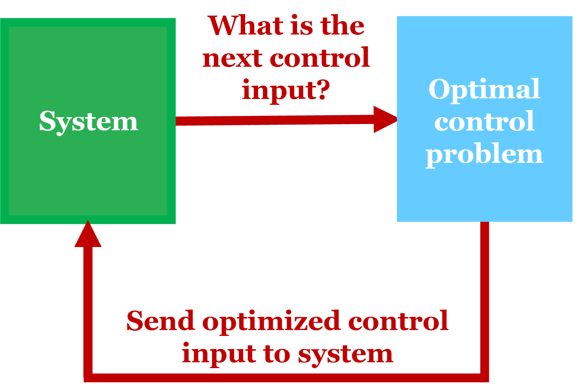

```@meta
DocTestFilters = [r"≤|<=", r" == | = ", r" ∈ | in ", r" for all | ∀ ", r"d|∂", 
                  r"E|𝔼", r"integral|∫"]
```

# Re-solve Tutorial
There are settings where one may want to repeatedly solve problems defined in `InfiniteOpt`, such as in model predictive control. To support this, `InfiniteOpt` provides a re-solve framework that enables model updates between solves without rebuilding the backend or reinitializing the solver. This is facilitated through the following APIs:

- [`set_parameter_value`](@ref) for updating parameters and parameter functions
- [`warmstart_backend_start_values`](@ref) for warmstarting the backend using a previous solution

As a result, we get a persistent backend and solver instance across subsequent solves, reducing initialization overhead and improving performance.

Below, we demonstrate how to do efficient re-solves via model predictive control of a continuous stirred tank reactor (CSTR). For re-solving on GPUs, see the [InfiniteExaModels](@ref examodels_solves) section.

## Preliminaries 
### Software Setup
First, we need to make sure everything is installed. This will include:
- installing Julia 
- installing `InfiniteOpt.jl`
- installing wanted optimizers e.g., `Ipopt.jl`
- installing `Plots.jl` for plotting results
See [Installation](@ref) for more information.

### Problem Formulation
Consider a model predictive control (MPC) problem over a time domain ``D_{mpc} = [t_{0}, t_{f}]``, consisting of ``N_{mpc}`` control steps with a control interval of ``\Delta t``. At each control step ``t_k`` for ``k \in \{1, 2, ..., N_{mpc}\}``, an optimal control problem is solved to predict system behavior and determine the optimal input for the next control step. As such, this sets up the stage for optimal control re-solves. See below for a diagram of the MPC workflow:




We define our optimal control problem over the prediction horizon ``\mathcal{D_p} = [0, t_p]``, where the objective is set to track a setpoint ``T_{sp}(t)``. We also define the control horizon ``\mathcal{D_c} = [0, t_c]``, where ``t_c \leq t_p``, representing the subset of ``\mathcal{D_p}`` over which the control input is allowed to vary. Here is the full optimal control formulation:
```math
\begin{aligned}
	&&\underset{C_A(t), T(t), T_c(t)}{\text{min}} &&& \int_{t \in \mathcal{D_p}} (T(t) - T_{sp}(t))^2 dt\\
	&&\text{s.t.} &&& C_a(0) = C_{A}(t_k)\\
    &&&&& T(0) = T(t_k)\\
    &&&&& k = k_0 \exp\left(\frac{-E_R}{T(t)}\right), & \forall t \in \mathcal{D_p}\\
    &&&&& r_A = kC_A(t),& \forall t \in \mathcal{D_p}\\
	&&&&& \frac{\partial C_A(t)}{\partial t} = \frac{F(C_f - C_A(t)) - Vr_A}{V}, & \forall t \in \mathcal{D_p}\\
    &&&&& \frac{\partial T(t)}{\partial t} = \frac{F\rho c_p(T_f - T(t)) + r_AH_RV + U_A(T_c(t) - T(t))}{\rho c_p V}, & \forall t \in \mathcal{D_p}\\
    &&&&& T_c(t) = T_c(t_c), & \forall t \in \mathcal{D_p} \setminus \mathcal{D_c}\\
    &&&&& C_A(t) \geq 0, & \forall t \in \mathcal{D_p}\\
    &&&&& 273.15 \leq T(t) \leq 400, & \forall t \in \mathcal{D_p}\\
    &&&&& 250 \leq T_c(t) \leq 350, & \forall t \in \mathcal{D_p}\\
\end{aligned}
```
Here, our state variables are concentration ``C_A(t)`` and reactor temperature ``T(t)``, while the control input is the jacket temperature ``T_c(t)``. There is also a constraint to keep input ``T_c(t)`` constant beyond the control horizon ``D_c``. Overall, this results in a dynamic model based on time ``t``.

## Problem setup
### Parameter specification
Before moving on, we'll need to define the necessary constants and problem 
parameters. We'll define the following in our 
Julia session (these could also be put into a script as shown later on):
```jldoctest quick
julia> Δt = 0.1; t0 = 0; tf = 1; tp = 3; tc = 2.5; # set MPC simulation parameters

julia> Dmpc = t0:Δt:tf; Dp = 0:Δt:tp; # set problem domains

julia> states = [0.9, 305]; # set the initial conditions for state

julia> F, V, rho, cp, Hr, E, k₀, Ua, cf, Tf = [100, 100, 1000, 0.239, 5e4, 8750, 7.2e10, 5e4, 1.0, 350]; # set the problem parameters
```
We'll also create a function for our temperature setpoint ``T_{sp}(t)``, which is defined below:
```math
T_{sp}(t) = 
\left\{
\begin{aligned}
&& 310, & \quad t_0 \leq t < 0.7 \\
&& 323, & \quad 0.7 \leq t < 1.3 \\
&& 318, & \quad 1.3 \leq t \leq t_f \\
\end{aligned}
\right.
```
```jldoctest quick
julia> function setpoint(t, offset)
        t += offset
        if t < 0.5
            return 310
        elseif t < 1.3
            return 323
        else
            return 318
        end
        end;
```
Note that an `offset` argument is added to ensure the setpoint function returns accurate values depending on what control step ``t_k`` the problem is posed at. 

### Problem model 
From here, we'll initialize our `InfiniteModel`, using Ipopt as the optimizer:
```jldoctest quick
julia> using InfiniteOpt, Ipopt;

julia> model = InfiniteModel(TranscriptionBackend(Ipopt.Optimizer, update_parameter_functions = true))
An InfiniteOpt Model
Feasibility problem with:
  Finite parameters: 0
  Infinite parameters: 0
  Variables: 0
  Derivatives: 0
  Measures: 0
Transformation backend information:
  Backend type: TranscriptionBackend
  Solver: Ipopt
  Transformation built and up-to-date: false
```
Note that we also set the keyword argument `update_parameter_functions = true`. This is only necessary if you plan on updating parameter functions while working with `TranscriptionBackend`s. In this case, we will need it to update our setpoint function ``T_{sp}(t)``. Learn more about `TranscriptionBackend`s on our 
[Model Transcription](@ref transcription_docs) page.

Next, let's make finite parameters via [`@finite_parameter`](@ref) to represent initial conditions for ``C_A`` and ``T``. This will allow us to update them between solves via [`set_parameter_value`](@ref):
```jldoctest quick
julia> @finite_parameter(model, Ca0 == states[1]);

julia> @finite_parameter(model, T0 == states[2]);
```
Next, we'll create an infinite parameter `t` to represent our time domain via [`@infinite_parameter`](@ref).
```jldoctest quick
julia> @infinite_parameter(model, t in [0, tp], supports = collect(Dp), 
                           derivative_method = OrthogonalCollocation(3));
```
Now we'll create a parameter function for ``T_{sp}(t)`` via [`@parameter_function`](@ref), enabling setpoint updates between solves. Here, we embed the `setpoint` function we created earlier, basing it off the infinite parameter `t`. Note that `tk` is also included as the control step offset:
```jldoctest quick
julia> @parameter_function(model, Tsp == t -> setpoint(t, tk))
Tsp(t)
```
Continuing on, we define our InfiniteOpt problem as normal:
```jldoctest quick
julia> @variable(model, 0 ≤ Ca, Infinite(t), start = states[1]);

julia> @variable(model, 273.15 ≤ T ≤ 400, Infinite(t), start = states[2]);

julia> @variable(model, 250 ≤ Tc ≤ 350, Infinite(t), start = 300);

julia> @objective(model, Min, integral((T - Tsp)^2, t))
∫{t ∈ [0, 3]}[T(t)² - 2 Tsp(t)*T(t) + Tsp(t)²]

julia> @constraint(model, Ca(0) == Ca0)
Ca(0) - Ca0 = 0

julia> @constraint(model, T(0) == T0)
T(0) - T0 = 0

julia> @expression(model, k, k₀ * exp(-E/T))
7.2e10 * exp(-8750.0 / T(t))

julia> @expression(model, rate, k*Ca)
7.2e10 * Ca(t) * exp(-8750.0 / T(t))

julia> @constraint(model, deriv(Ca, t) == (F*(cf - Ca) - V*rate)/V);

julia> @constraint(model, deriv(T, t) == (1/(rho * cp * V)) * (F * rho * cp * (Tf - T) + V * Hr * rate + Ua * (Tc - T)));
```

To add a constraint for the control horizon, we can use [`DomainRestriction`](@ref).
 ```jldoctest quick
julia> control_func(t_c) = (tc < t_c ≤ tp); # Function for domain values

julia> control_domain = DomainRestriction(control_func, t);   # Create domain restriction for infinite parameter t

julia> @constraint(model, Tc == Tc(tc), control_domain);  # Add constraint defined on restricted domain
```

We also call [`constant_over_collocation`](@ref constant_over_collocation(::InfiniteVariableRef, ::GeneralVariableRef)) 
on our control variable `Tc` to address any unwanted degrees of freedom introduced by internal collocation 
nodes from [`OrthogonalCollocation`](@ref):
```jldoctest quick
julia> constant_over_collocation.(Tc, t);
``` 
That's it for defining our `InfiniteOpt` problem! Now, let's solve via [`optimize!`](@ref):
```jldoctest quick; setup = :(set_attribute(model, "print_level", 0))
julia> tk = 0;   # Offset for first control step

julia> set_silent(model);   # Repress solver output

julia> optimize!(model)
```
We can check how many iterations the solver took via [`barrier_iterations`](@ref):
```jldoctest quick
julia> barrier_iterations(model)
11
```

### Simulating the system
Now we'll extract the input for the next control step via
[`value`](@ref JuMP.value(::GeneralVariableRef)):
```jldoctest quick
julia> Tc_opt = value.(Tc)[2];
```
From here, `Tc_opt` will be used to simulate the system forward and get up-to-date states for updating initial conditions. For this tutorial, we'll use a dummy function as follows:
```jldoctest quick
julia> function sim_func(x, u, dt)
        Ca, T = x
        Tc = u
        k = k₀ * exp(-E/T)
        rate = k * Ca
        dCa = F/V * (cf - Ca) - V * rate
        dT = (1/(rho * cp * V)) * (F * rho * cp * (Tf - T) + V * Hr * rate + Ua * (Tc - T))
        return x .+ dt .* [dCa, dT]
        end;

julia> states = sim_func(states, Tc_opt, Δt);   # update states
```
Outside of this tutorial, users should replace `sim_func` with their system model. For example, one could choose to set up and solve an ODE problem via `DifferentialEquations.jl`.

## Re-solves
### Updating the model
Now we need to update our model for the next solve! First, we update our control step accordingly:
```jldoctest quick
julia> tk += Δt;
```
We then update the start values via [`warmstart_backend_start_values`](@ref). This will use the previous solution to warmstart all possible variables (e.g., primal, dual, etc...).
```jldoctest quick
julia> warmstart_backend_start_values(model);
```
!!! note
    This will only update the start values in the backend.
    The start values in the `InfiniteModel` will remain the same.

We'll also update the initial condition parameters using [`set_parameter_value`](@ref).
```jldoctest quick
julia> set_parameter_value(Ca0, states[1]);

julia> set_parameter_value(T0, states[2]);
```
Lastly, we'll need to update the setpoint parameter function, which can also be done via [`set_parameter_value`](@ref). We'll create a new function `Tsp_new` with an updated offset value for the new control step. Then we can update `Tsp` with `Tsp_new`.
```jldoctest quick
julia> Tsp_new = (t) -> setpoint(t, tk);

julia> set_parameter_value(Tsp, Tsp_new);
```
!!! note
    The new function must have the same infinite parameter format as the original parameter function.

Now we can call `optimize!` again to solve our updated model! 
```jldoctest quick
julia> optimize!(model)

julia> barrier_iterations(model)
16
```
!!! warning
    The re-solve framework's efficiency is based on the idea that the problem structure remains the same between solves (AKA no new variables or constraints are added).
    If changing the structure or using APIs other than `warmstart_backend_start_values` or `set_parameter_value` for updating, then a new backend and solver instance will be made from scratch.

### [Performance tips](@id resolve_performance)
Given a warmstart, we can also reduce the number of iterations by decreasing certain solver options via [`set_optimizer_attribute`](https://jump.dev/JuMP.jl/stable/api/JuMP/#set_optimizer_attribute). Here, `bound_push` and `bound_frac` are solver options that determine how much the initial point might have to be adjusted to be sufficiently inside the problem bounds. Since our warmstart is presumably close to the actual solution, we can decrease both values for better performance. We can also decrease the initial barrier parameter `mu_init` for the same reason.
```jldoctest quick
julia> set_optimizer_attribute(model, "bound_push", 1e-8); # Desired minimum distance from intial point to bounds

julia> set_optimizer_attribute(model, "bound_frac", 1e-8); # Desired minimum relative distance from initial point to bounds

julia> set_optimizer_attribute(model, "mu_init", 1e-11); # Initial barrier parameter value
```
Note that the chosen values here are not always good, as optimal values are problem dependent. Moving on, solving with these new solver options reduces the number of iterations:
```jldoctest quick
julia> optimize!(model)

julia> barrier_iterations(model)
8
```

## Model Predictive Control Script 
The steps outlined in the sections above can be captured in an MPC loop. This is summarized in the script below, along with a plot of the MPC solution values:
```@example
using InfiniteOpt, Ipopt, Plots

# DEFINE THE PROBLEM CONSTANTS
F = 100       # m³/s
V = 100       # m³
rho = 1000    # kg/m³
cp = 0.239    # J/kg K
Hr = 5e4      # Heat of reaction J/mol
E = 8750      # E/R K
k₀ = 7.2e10   # Pre-exponential factor 1/s
Ua = 5e4      # Heat transfer coefficient J/s K
cf = 1.0      # Feed concentration mol/m³
Tf = 350      # Feed temperature K
states = [0.9, 305]  # Initial conditions

# DEFINE MPC PARAMETERS
t0 = 0            # Initial simulation time
tf = 1            # Final simulation time; keep it small with 10 iterations
Δt = 0.1          # Control interval
tp = 3            # Prediction endpoint
tc = 2.5          # Control endpoint
Dmpc = t0:Δt:tf   # MPC Simulation domain
Dp = 0:Δt:tp      # Prediction horizon
Dc = 0:Δt:tc      # Control horizon

# DEFINE ARRAYS TO STORE SOLUTION VALUES
Ca_vals, T_vals, Tc_vals = [], [], []

# INITIALIZE RELEVANT FUNCTIONS
function setpoint(t, offset)
    t += offset
    if t < 0.5
        return 310
    elseif t < 1.3
        return 323
    else
        return 318
    end
end

function sim_func(x, u, dt)
    Ca, T = x
    Tc = u
    k = k₀ * exp(-E/T)
    rate = k * Ca
    dCa = F/V * (cf - Ca) - V * rate
    dT = (1/(rho * cp * V)) * (F * rho * cp * (Tf - T) + V * Hr * rate + Ua * (Tc - T))
    return x .+ dt .* [dCa, dT]
end

# INITIALIZE THE MODEL
model = InfiniteModel(TranscriptionBackend(Ipopt.Optimizer, update_parameter_functions = true))

# INITIALIZE PARAMETERS & PARAMETER FUNCTIONS
@infinite_parameter(model, t ∈ [0, tp],
                supports = collect(Dp),
                derivative_method = OrthogonalCollocation(3))
@finite_parameter(model, Ca0 == states[1])
@finite_parameter(model, T0 == states[2])
@parameter_function(model, Tsp == t -> setpoint(t, 0))

# INITIALIZE THE VARIABLES
@variables(model, begin
    0 ≤ Ca, Infinite(t), (start = states[1])
    273.15 ≤ T ≤ 400, Infinite(t), (start = states[2])
    250 ≤ Tc ≤ 350, Infinite(t), (start = 300)
end)

# SET THE OBJECTIVE
@objective(model, Min, ∫((T - Tsp)^2, t))

# SET THE INITIAL CONDITIONS
@constraint(model, initialCa, Ca(0) == Ca0)
@constraint(model, initialT, T(0) == T0)

# SET THE PROBLEM CONSTRAINTS
@expression(model, k, k₀ * exp(-E/T))
@expression(model, rate, k * Ca)
@constraint(model, ∂(Ca, t) == (F * (cf - Ca) - V * rate)/V)
@constraint(model, ∂(T, t) == (1/(rho * cp * V)) * (F * rho * cp * (Tf - T) + V * Hr * rate + Ua * (Tc - T)))

# SET THE CONTROL HORIZON CONSTRAINT
control_func(t_c) = (tc ≤ t_c ≤ tp)
control_domain = DomainRestriction(control_func, t)
@constraint(model, Tc == Tc(tc), control_domain)

# ADJUST DEGREES OF FREEDOM FOR CONTROL VARIABLES
constant_over_collocation.(Tc, t)

# SET MODEL TO SILENT MODE TO REPRESS SOLVER OUTPUT
set_silent(model)

# MPC LOOP
for tk in Dmpc
    # SOLVE THE MODEL
    optimize!(model)

    # GET THE OPTIMAL INPUT & STORE IN ARRAY
    Tc_opt = value.(Tc)[2]
    push!(Tc_vals, Tc_opt)
    
    # SIMULATE SYSTEM FORWARD & STORE STATES
    states[1:2] = sim_func(states, Tc_opt, Δt)
    push!(Ca_vals, states[1])
    push!(T_vals, states[2])

    # WARMSTART MODEL FOR NEXT SOLVE
    warmstart_backend_start_values(model)

    # UPDATE PARAMETERS
    set_parameter_value(Ca0, states[1])
    set_parameter_value(T0, states[2])
    Tsp_new = (t) -> setpoint(t, tk + Δt)
    set_parameter_value(Tsp, Tsp_new)

    # ADJUST SOLVER PARAMETERS
    set_optimizer_attribute(model, "bound_push", 1e-8)
    set_optimizer_attribute(model, "bound_frac", 1e-8)
    set_optimizer_attribute(model, "mu_init", 1e-11)
end

# PLOT THE RESULTS
t_vals = collect(Dmpc)
Tsp_vals = setpoint.(t_vals, 0)
p1 = plot(t_vals, Ca_vals, ylabel="Concentration", label="Ca", lw=2)
p2 = plot(t_vals, Array{Float64}([T_vals Tc_vals Tsp_vals]), 
        ylabel="Temperature", 
        label=["Reactor T" "Coolant Tc" "Setpoint Tsp"],
        lw=2, ls=[:solid :dot :dash])
combinedPlot = plot(p1, p2, layout = (2, 1), xlabel="Time", 
    title="CSTR MPC Control", legend=:right)
```

## [Re-solves with InfiniteExaModels.jl](@id examodels_solves)
### Software Setup
Alternatively, [`InfiniteExaModels.jl`](https://github.com/infiniteopt/InfiniteExaModels.jl) can be used to improve performance. Instead of a `JuMP` model, we can work with an `ExaModel` that exploits recurrent problem structure, cutting down on both model and automatic differentiation (AD) time. First, we'll need to ensure the following packages are installed:
- `InfiniteExaModels.jl`
- `NLPModelsIpopt.jl` (if solving on CPU)

If solving on GPU, we'll also need to install:
- `MadNLP.jl`
- `CUDA.jl`
- `CUDSS.jl`

!!! note
    Currently, the GPU workflow is only available on NVIDIA GPUs that support CUDA.

### Solving on CPU
When initializing the model, we specify an `ExaTranscriptionBackend` which will transcribe the `InfiniteOpt` problem into an `ExaModel`. For solving on CPU specifically, we use `NLPModelsIpopt` as the solver.

```jldoctest quick
julia> using InfiniteExaModels, NLPModelsIpopt

julia> model = InfiniteModel(ExaTranscriptionBackend(NLPModelsIpopt.IpoptSolver));
```

### Solving on GPU
For GPU, we'll want to define an `ExaTranscriptionBackend` that employs a `CUDABackend`. We'll also use the `MadNLPGPU` module from `MadNLP.jl` for solving.
```julia
julia> using InfiniteExaModels, MadNLPGPU, CUDA

julia> model = InfiniteModel(ExaTranscriptionBackend(MadNLPSolver, backend = CUDABackend()));
```
Since we'll be indexing `Tc` for the optimal control input, we'll also need to set `allowscalar` to true.
```julia
julia> CUDA.allowscalar(true);
```
As mentioned in the [`Performance tips`](@ref resolve_performance) section earlier, we can be more performant by adjusting `MadNLP` solver options when given a warmstart. Note that the numerical value chosen here is different than what we originally chose when warmstarting with `Ipopt`. This highlights that the optimal value is not only problem-dependent, but also depends on the chosen solver.
```
julia> set_optimizer_attribute(model, "mu_init", 2E-2)
```
That's all we need to change for the GPU setup! From here, we follow the same steps as the sections above to define the rest of our problem & solve.

!!! note
    Although `MadNLP.jl` does support `bound_push` and `bound_fac` as solver options, they currently do not have an effect in re-solves.
